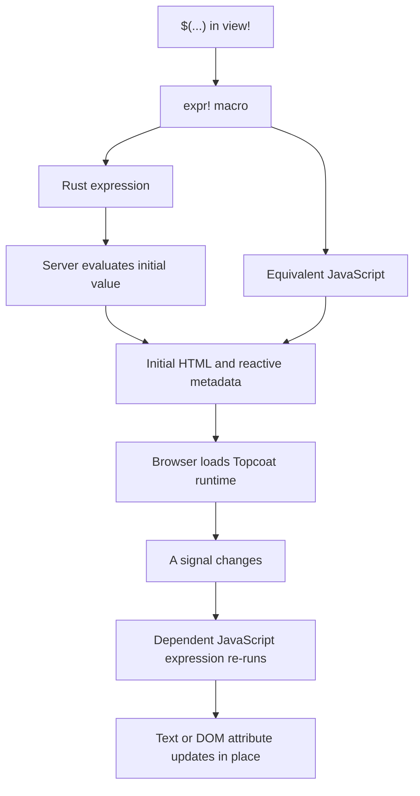

# How `$(...)` reaches the browser

A `$(...)` block is a **runtime expression**. You write one Rust expression, but Topcoat produces two
representations from it:

1. ordinary Rust that runs during the server render; and
2. equivalent JavaScript that ships with the HTML and can run again in the browser.

The server result supplies the initial page. The JavaScript supplies later interaction without a
WebAssembly bundle, a separate frontend build, or a server request for every state change.

*Guide basis: Topcoat v0.8.0 [Runtime expressions](https://raw.githubusercontent.com/tokio-rs/topcoat/v0.8.0/crates/topcoat/docs/runtime.md#runtime-expressions)
and the release-tagged [`expr!` vocabulary guide](https://raw.githubusercontent.com/tokio-rs/topcoat/v0.8.0/crates/topcoat-runtime/macro/docs/expr.md).*



## The server renders the first value

During the initial request, `$(...)` behaves like typed Rust. Topcoat evaluates it while rendering
the surrounding `view!`, then uses the result for the initial text or attribute value. A page does
not wait for JavaScript before it becomes meaningful HTML.

The same macro expansion also carries JavaScript source for the browser. Topcoat serializes signal
declarations and reactive metadata into the response, and its runtime discovers them after the page
loads. The JavaScript remains idle until an event or signal change gives it work to do.

Lab 07 proves both halves in an integration test. The server initially leaves every berth visible,
while the HTML still contains signal declarations, event handlers, and bind metadata for the
browser:

```rust
{{#include ../../../labs/lab-07-signals-expressions/solution/tests/reactivity.rs:reactivity-integration-test}}
```

*Guide basis: Topcoat v0.8.0 [Runtime expressions](https://raw.githubusercontent.com/tokio-rs/topcoat/v0.8.0/crates/topcoat/docs/runtime.md#runtime-expressions),
[Signals](https://raw.githubusercontent.com/tokio-rs/topcoat/v0.8.0/crates/topcoat/docs/runtime.md#signals), and
[Bind attributes](https://raw.githubusercontent.com/tokio-rs/topcoat/v0.8.0/crates/topcoat/docs/runtime.md#bind-attributes).*

## Signals give the browser state

Create a signal in the component, page, layout, or shard body with `signal(cx, || initial_value)`.
The request context is required because the initial value is computed during the server render and
serialized into the page. Pass a signal to a child as `&Signal<T>` when the child needs to read it.

Calling `.get()` inside `$(...)` reads the browser-owned value. When browser code changes that signal
with `.set(...)`, `.toggle()`, or another supported write, dependent expressions run again and patch
their own text or attributes in place.

This is client-only state, not hidden server state. It is suitable for opening a panel, filtering
markup already in the page, or keeping an input and label synchronized. It cannot query a database
from the browser or observe a later server change.

*Guide basis: the v0.8.0 runtime guide's [Signals](https://raw.githubusercontent.com/tokio-rs/topcoat/v0.8.0/crates/topcoat/docs/runtime.md#signals)
section and the v0.8.0 [`Signal` vocabulary](https://raw.githubusercontent.com/tokio-rs/topcoat/v0.8.0/crates/topcoat-runtime/macro/docs/expr.md#the-shared-vocabulary).*

## Handlers write; expressions and binds read

An attribute beginning with `@` is an event handler. Its `$(...)` value is normally a closure that
runs in the browser when the named DOM event fires. The closure can read the event and update
signals.

An attribute beginning with `:` is a bind attribute. The server renders its initial value as an
ordinary HTML attribute. The browser then keeps that attribute synchronized with the expression.
Together, `:value` and `@input` form a two-way connection between an input and a signal.

Lab 07 combines handlers and binds into a filter whose interactions make no network request:

```rust
{{#include ../../../labs/lab-07-signals-expressions/solution/src/app/_marketing/berths.rs:berth-filter}}
```

The filter's `@input` handler writes the query signal. Each row's `:hidden` expression reads that
signal and the status signals. Only those dependent expressions re-run after an edit or click.

*Guide basis: Topcoat v0.8.0 [Event handlers](https://raw.githubusercontent.com/tokio-rs/topcoat/v0.8.0/crates/topcoat/docs/runtime.md#event-handlers)
and [Bind attributes](https://raw.githubusercontent.com/tokio-rs/topcoat/v0.8.0/crates/topcoat/docs/runtime.md#bind-attributes).*

## Server reads are tracked or untracked

A signal read in ordinary Rust, outside `$(...)`, has server-side consequences. `.get()` and `.read()`
are tracked reads: the page or component depends on the signal, so a browser change can re-run that
server body with the current value and morph the resulting HTML into place. Use `.get_untracked()` or
`.read_untracked()` when you need the current value but do not want that dependency.

The browser owns every signal after the initial render. Treat every value read on the server as user
input: validate it before querying, authorizing, or mutating anything. A shard is often the better
choice when only one region needs to re-render.

*Guide basis: the v0.8.0 runtime guide's [Reading signals on the server](https://raw.githubusercontent.com/tokio-rs/topcoat/v0.8.0/crates/topcoat/docs/runtime.md#reading-signals-on-the-server)
section.*

## Captures are render-time snapshots

A name used inside `$(...)` but declared outside it is a captured value. Topcoat serializes that
value during the server render and turns it into a constant available to the generated JavaScript.

The berth filter captures each berth's name and occupied status. Those values describe the HTML the
server just rendered, so the browser can compare them with live signal values. If the berth changes
in the database afterward, the captures do not update. They remain snapshots from that response.

Use a shard when changing server data must produce new markup. Do not treat a captured value as a
live connection to Rust memory or the database.

*Guide basis: the Topcoat v0.8.0 [`expr!` guide — Captured variables](https://raw.githubusercontent.com/tokio-rs/topcoat/v0.8.0/crates/topcoat-runtime/macro/docs/expr.md#captured-variables).*

## One vocabulary must work in both languages

The Rust and JavaScript forms must produce equivalent behavior. Topcoat therefore supports a
restricted shared vocabulary rather than arbitrary Rust. In v0.8.0 it includes `f64`, `bool`,
`String` and `&str`, `Option`, `Result`, tuples, and signals, with a documented subset of methods.

All numbers are `f64` so their model agrees with JavaScript. Write `1.0`, not `1`. String operations
also follow Rust semantics in both outputs: for example, `len()` counts UTF-8 bytes even though
native JavaScript strings normally expose UTF-16 code units.

Supported expression shapes include literals, the documented operators, method calls, blocks with
simple `let` bindings, `if`/`else`, closures, `.await`, and basic loops. Unsupported syntax is a
compile error rather than JavaScript that behaves differently from the server result.

*Guide basis: the Topcoat v0.8.0 [`expr!` guide — Shared vocabulary and supported syntax](https://raw.githubusercontent.com/tokio-rs/topcoat/v0.8.0/crates/topcoat-runtime/macro/docs/expr.md#the-shared-vocabulary).*

## Unsupported Rust fails at compile time

`match`, integer literals, struct expressions, multi-segment paths, and `&&`/`||` are outside the
v0.8.0 expression vocabulary. Lab 07 deliberately preserves an invalid `match` example as a comment
so you can reproduce the compiler diagnostic:

```rust
{{#include ../../../labs/lab-07-signals-expressions/solution/src/app/_marketing.rs:unsupported-expression}}
```

Restructure first. The berth filter replaces logical operators with `let` bindings and
`if`/`else`, which keeps both outputs type-checked and equivalent.

*Guide basis: the Topcoat v0.8.0 [`expr!` guide — Supported syntax](https://raw.githubusercontent.com/tokio-rs/topcoat/v0.8.0/crates/topcoat-runtime/macro/docs/expr.md#supported-syntax).*

## `raw!` is the escape hatch

When the shared vocabulary cannot express an operation, `raw!` can provide hand-written JavaScript.
Its optional second argument is the equivalent Rust expression used during server rendering. If you
omit that Rust form, the expression can only run in a browser-only position.

This escape hatch removes part of the guarantee that makes `$(...)` useful. You are responsible for
keeping the JavaScript and Rust behavior equivalent, so prefer restructuring the expression first.
Use raw JavaScript only for a small operation that cannot yet be stated in the v0.8.0 vocabulary.

*Guide basis: the Topcoat v0.8.0 [`expr!` guide — Embedding JavaScript](https://raw.githubusercontent.com/tokio-rs/topcoat/v0.8.0/crates/topcoat-runtime/macro/docs/expr.md#embedding-javascript).*

## The runtime script completes the path

Generated JavaScript needs Topcoat's browser runtime. `topcoat::runtime::script()` adds that script
to the document, and the router must serve the matching asset bundle. Lab 07 makes the bundle
optional so normal execution loads it while in-process tests can render without an asset directory:

```rust
{{#include ../../../labs/lab-07-signals-expressions/solution/src/app.rs:app-router}}
```

The root layout emits the runtime script only when the matching bundle is available:

```rust
{{#include ../../../labs/lab-07-signals-expressions/solution/src/app/_marketing.rs:runtime-script}}
```

The binary and asset bundle must come from the same build. Without the script, the server-rendered
HTML still exists, but handlers and reactive binds do not run in the browser.

*Guide basis: Topcoat v0.8.0 [Runtime setup](https://raw.githubusercontent.com/tokio-rs/topcoat/v0.8.0/crates/topcoat/docs/runtime.md#setup)
and [Runtime expressions](https://raw.githubusercontent.com/tokio-rs/topcoat/v0.8.0/crates/topcoat/docs/runtime.md#runtime-expressions).*

**See also:** [Lab 07 — Signals and expressions](../02-labs/lab-07.md),
[Request lifecycle](request-lifecycle.md), [Shards, procedures, live regions, htmx](reactivity-options.md),
and [Assets, styling, and owned UI](assets-styling-ui.md).
