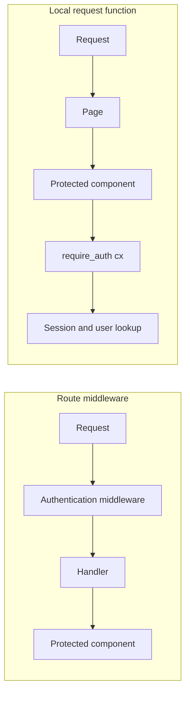

# Locality of behaviour vs middleware

Authentication is often configured around a route and consumed somewhere deeper in the handler.
Topcoat recommends a different default for request-scoped application policy: write a focused
`async fn` that accepts `&Cx`, then call it where its result is needed.

That is **locality of behaviour**. The authorization check, the data it unlocks, and the markup that
uses that data stay visible in one place.

This page follows Topcoat v0.8.0's [Functions, not
middlewares](https://raw.githubusercontent.com/tokio-rs/topcoat/v0.8.0/crates/topcoat/docs/functions_not_middlewares.md)
guide.



## Put the requirement beside the behaviour

Middleware makes authentication a property of route configuration. The handler trusts that an outer
layer ran, often reads a user from request extensions, and passes that user down to the code that
needs it.

That arrangement can be correct. Its weakness is distance. You cannot tell whether a component is
safe by reading the component alone. You must also inspect every route that can render it and verify
that the right middleware wraps each route in the right order.

A Topcoat request function makes the dependency explicit at the use site. Lab 06 resolves the
current user from the request-scoped session and turns a missing user into a redirect:

```rust
{{#include ../../../labs/lab-06-auth-sessions-mail/solution/src/auth.rs:require-auth}}
```

The protected component calls the function before it renders private data:

```rust
{{#include ../../../labs/lab-06-auth-sessions-mail/solution/src/app/_marketing.rs:protected-work-orders}}
```

You can now move `work_orders` between pages without separating it from its guard. A public page may
embed the component, but an unauthenticated request still stops at `require_auth`.

The requirement travels with the behaviour it protects.

## Build small functions by meaning

Do not replace one large middleware stack with one large request function. Separate the decisions:

- read a cookie or session token from `Cx`;
- resolve an optional current user;
- require a signed-in user;
- build `require_admin` or `require_tenant_member` on top.

Public UI can ask for an optional user and render a signed-out state. Private UI can call
`require_auth(cx).await?` and fail closed. The helpers share request context without forcing every
layout and component between them to accept and forward a user parameter.

This works naturally because Topcoat components are async Rust functions. `Cx` is available wherever
a component declares it, and `?` propagates the redirect or error through the normal return path.
There is no second dependency-injection mechanism to configure.

When several components ask the same question, place expensive lookup work behind `#[memoize]`.
Memoization deduplicates identical calls within the request while each component keeps its local,
explicit dependency. It does not turn request data into a global cache.

## Local checks survive composition

Locality matters when markup appears somewhere its author did not originally expect. Lab 06 embeds
the protected work-orders component on a public dashboard. The integration test proves that the
component still redirects an unauthenticated request:

```rust
{{#include ../../../labs/lab-06-auth-sessions-mail/solution/tests/auth.rs:auth-integration-test}}
```

The same rule becomes more important with partial endpoints. A shard or procedure request invokes
that endpoint directly; page and layout guards do not run first. Calling `require_auth(cx)` inside
the endpoint keeps the requirement attached to the server operation rather than to one page that
happens to expose it.

> [!WARNING]
> Locality does not make authorization automatic. Every entry point that reads or changes protected
> data must call the appropriate guard, and every client-supplied argument remains untrusted.

## What you give up versus middleware

The function style has real costs.

- **You give up blanket enforcement by router configuration.** Correctly mounted middleware can
  protect an entire route subtree in one place. A local guard is opt-in. If an author forgets the
  call, the route table cannot save them.
- **You give up one central policy map.** Middleware stacks make it easy to list the layers around a
  route. Local calls are distributed through components and request functions, so audits need code
  search, conventions, and tests.
- **You may execute the same policy path more than once.** A layout, page, and nested component can
  all ask for the current user. `#[memoize]` removes repeated expensive work, but the calls and result
  propagation still exist.
- **You give up some ecosystem uniformity.** Tower middleware is a shared abstraction across many
  Rust HTTP frameworks. A project-specific `require_auth(&Cx)` function is simpler locally, but it
  is not a reusable middleware package that another router can mount unchanged.
- **You must choose the guard boundary carefully.** Guarding only a small nested component may allow
  public page work to run before authentication fails. If the whole page is private, call the guard
  at the page boundary as well as inside independently callable protected endpoints.

These are not reasons to hide policy again. They are reasons to support local guards with naming,
review, integration tests, and memoized lookup functions.

## Middleware still has a job

Local request functions are best when application code needs an answer: who is the user, which
tenant is active, which feature is enabled, or whether this operation is allowed.

Middleware and router layers remain a better fit for transport-wide behaviour that should apply
regardless of what the page renders. Examples include tracing, compression, request normalization,
body limits, and CORS.

A useful boundary is:

- use a `cx` function when the policy follows **the application behaviour**;
- use a layer when the policy follows **the HTTP transaction**.

Topcoat's guidance is not “middleware is bad.” It is “do not move a component's request-scoped
requirements away from the component merely because middleware is familiar.”

**See also:** [Lab 05 — Cx, app context, and memoization](../02-labs/lab-05.md),
[Lab 06 — Cookies, sessions, and mail](../02-labs/lab-06.md),
[Lab 08 — Shards, procedures, and streaming](../02-labs/lab-08.md),
[Request lifecycle](request-lifecycle.md), and
[Shards, procedures, live regions, htmx](reactivity-options.md).
