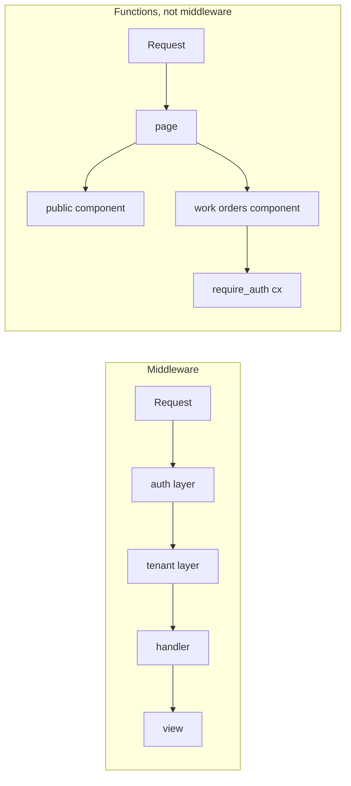

# Locality of behaviour vs middleware

Most web frameworks put cross-cutting concerns — authentication, tenancy, feature flags, locale — in
middleware: a chain wrapped around the router, running before the handler, mutating a request object
that the handler later reads. Topcoat's guidance is different. These are `async fn`s that take the
request context and are called from the component that needs them.

## What changes

In the middleware model, whether a piece of markup is protected is a property of its **route**. The
handler is trusted because of where it was mounted. That works until the same markup is rendered
somewhere else — embedded in a public dashboard, pulled into a partial, reused by a second route —
at which point the protection quietly does not apply, and nothing in the file tells you.

In the Topcoat model, protection is a property of the **component**. A component that shows work
orders calls `require_auth(cx).await?` as its first line. Embed it on a public page and it still
refuses; delete the route and add another and it still refuses. The check travels with the thing it
protects, and you can see it by reading the file.

This is the same property [Lab 03](../02-labs/lab-03.md) demonstrates with data: a component that
fetches what it renders works wherever it is called, because nothing about it depends on a caller
having prepared something first. Auth is that idea applied to a guard rather than a query.

## Why it works here

It works because the pieces line up:

- A component is an ordinary `async fn`, so calling another `async fn` from it needs no machinery.
- The request context `Cx` is available to any component that declares it, so a guard does not need
  a mutated request object handed down a chain.
- A component returns `Result<impl View>`, so a guard can return an error — a redirect to `/login`,
  a `403` — with `?`, and the framework turns that into a response. Bailing out is a normal Rust
  return, not an early `next()` that has to be remembered.

## What you give up

Be honest about the trade:

- **It is opt-in.** Middleware applies to a whole subtree whether or not the author remembered it; a
  function call has to be written. A forgotten call is a hole, and no route table will show it to
  you. Convention and review carry weight they did not before.
- **The check can run many times per request.** Three components on a page, three calls. `#[memoize]`
  ([Lab 05](../02-labs/lab-05.md)) dedupes them within a request.
- **Genuinely global concerns still want a layer.** Compression, request logging, body limits and
  CORS are not per-component decisions. Topcoat provides router layers and a tower bridge
  ([Lab 13](../02-labs/lab-13.md)) for exactly these; the argument is about *authorisation and
  request-scoped policy*, not about every cross-cutting concern.

## The rule of thumb

Put it in a function called by the component when the answer depends on *what is being rendered*.
Put it in a layer when the answer depends only on *the HTTP transaction*.

[Lab 06](../02-labs/lab-06.md) implements `require_auth` this way, alongside cookies and sessions, and
proves the point with a protected component embedded on a public page.
