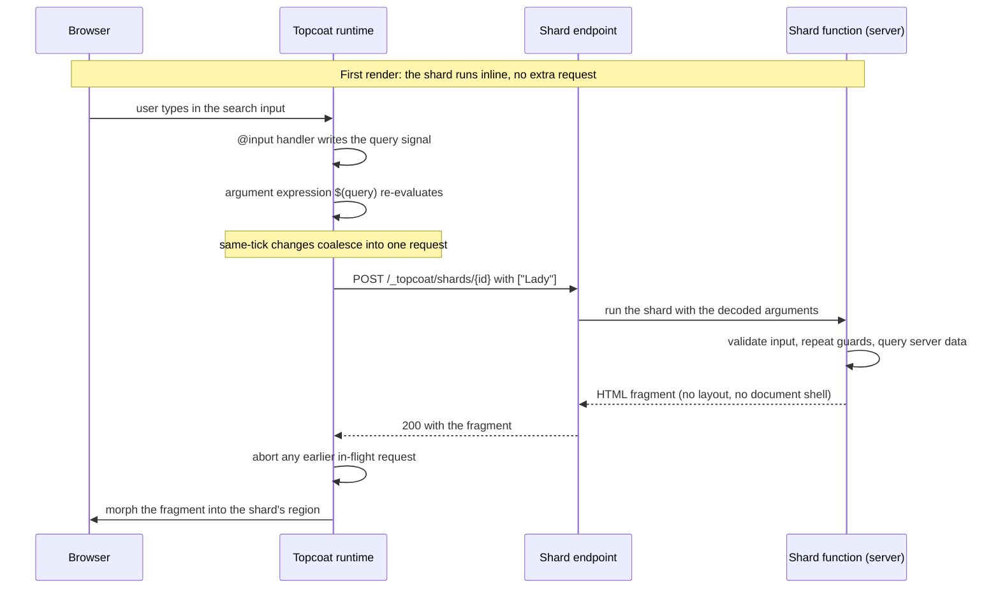

# Shards, procedures, live regions, htmx

Topcoat gives you several ways to make a page change after it renders. They are not ranked, and they
are not alternatives to each other in every situation. Each one answers a different question: *what
changed, who owns the answer, and who decides when to ask?*

Start from the question, not the mechanism.

| Mechanism | Who runs the update | Reach for it when |
|---|---|---|
| `signal` + `$(...)` | browser only | the answer is already in the page — toggling, filtering rendered rows, syncing an input |
| `#[shard]` | server, per argument change | the *markup* depends on server data that the browser does not have |
| `#[procedure]` | server, per call | a handler needs a server *action or value*, and the page updates itself locally |
| `live!` / `emit!` | server, during one response | part of the page is slow and you want the rest delivered first |
| `suspense` / `error_boundary` | server, during one response | you need the common one-fallback or one-failure shape of `live!` |
| htmx | browser decides, server answers | you need debouncing, indicators, or progressive enhancement today |
| Alpine AJAX | browser decides, server answers | the page already uses Alpine and you want AJAX in the same idiom |
| Datastar | server pushes | the server drives updates, often over a long-lived stream |

*Guide basis: the v0.8.0 [runtime guide](https://raw.githubusercontent.com/tokio-rs/topcoat/v0.8.0/crates/topcoat/docs/runtime.md),
[`live!` guide](https://raw.githubusercontent.com/tokio-rs/topcoat/v0.8.0/crates/topcoat-view/macro/docs/live.md), and the
[htmx](https://raw.githubusercontent.com/tokio-rs/topcoat/v0.8.0/crates/topcoat/docs/htmx.md),
[Alpine AJAX](https://raw.githubusercontent.com/tokio-rs/topcoat/v0.8.0/crates/topcoat/docs/alpine_ajax.md), and
[Datastar](https://raw.githubusercontent.com/tokio-rs/topcoat/v0.8.0/crates/topcoat/docs/datastar.md) integration guides.*

## Signals stay in the browser

A signal plus `$(...)` is the client-only end of Topcoat's reactivity spectrum. Create it with
`signal(cx, || initial_value)` and use it when the browser already has the answer: toggling a panel,
filtering rendered rows, or synchronizing an input. A runtime expression re-runs in JavaScript and
patches its node without a server request.

The middle ground is a **signal-parameter shard**. The page owns the signal, passes it as `$(query)`,
and the shard reads the `Signal<T>` in server code. The signal handle stays stable while its value
changes, so the shard is the boundary that re-renders instead of the whole page.

That makes a signal the wrong tool when the answer requires server data. A captured value is only a
snapshot from the render that produced it. [How `$(...)` reaches the browser](dual-expressions.md)
covers the mechanics.

*Guide basis: the v0.8.0 runtime guide's [Signals](https://raw.githubusercontent.com/tokio-rs/topcoat/v0.8.0/crates/topcoat/docs/runtime.md#signals)
and [Shards](https://raw.githubusercontent.com/tokio-rs/topcoat/v0.8.0/crates/topcoat/docs/runtime.md#shards) sections, plus the v0.8.0 [`expr!` vocabulary guide](https://raw.githubusercontent.com/tokio-rs/topcoat/v0.8.0/crates/topcoat-runtime/macro/docs/expr.md).*

## Shards re-render markup on the server

A `#[shard]` is a component whose arguments are runtime expressions. On the first render it runs
inline, like any component, and its output is part of the document. A shard can accept `Signal<T>`
directly; pass the handle as `$(query)` and read it in the shard body. When that read signal changes,
the browser sends the current value to the shard endpoint and the server re-renders only that region.

Lab 08's vessel search is a shard that owns the result list:

```rust
{{#include ../../../labs/lab-08-shards-procedures-streaming/solution/src/app/_marketing/vessels.rs:vessel-results-shard}}
```

The page owns the query signal, and passes it in:

```rust
{{#include ../../../labs/lab-08-shards-procedures-streaming/solution/src/app/_marketing/vessels.rs:vessel-search-page}}
```

The signal lives *outside* the shard on purpose. Topcoat morphs the returned HTML into the existing
region rather than replacing the subtree wholesale. Existing elements keep focus, scroll position,
and partially typed values. Give reorderable list items stable `id` attributes so the morph can follow
each item to its new position. State that must survive re-renders still belongs outside the shard and
flows in through arguments.



Only that region changes. Lab 08's test drives the endpoint directly and asserts the response is a
fragment, not a page:

```rust
{{#include ../../../labs/lab-08-shards-procedures-streaming/solution/tests/server_runtime.rs:shard-partial-response-test}}
```

In v0.8.0 the runtime coalesces changes made in one tick and aborts a stale request when a newer one
starts, so the latest arguments win. It does not debounce a pause between keystrokes — that is
application logic, and it is exactly what htmx gives you declaratively.

*Guide basis: the v0.8.0 [`#[shard]` guide](https://raw.githubusercontent.com/tokio-rs/topcoat/v0.8.0/crates/topcoat-runtime/macro/docs/shard.md)
and the [runtime guide — Shards](https://raw.githubusercontent.com/tokio-rs/topcoat/v0.8.0/crates/topcoat/docs/runtime.md#shards).*

## Procedures call the server without replacing markup

A `#[procedure]` is an async server function you `.await` from inside a runtime expression. Use it
when the browser needs a server *action* or *value* rather than new markup — marking a record
complete, saving a draft, computing something the expression vocabulary cannot.

```rust
{{#include ../../../labs/lab-08-shards-procedures-streaming/solution/src/app/_marketing.rs:complete-work-order-procedure}}
```

The call only runs in the browser, so it must sit in an async position such as an `async` closure
body. Arguments and the `Ok` type must belong to the shared expression vocabulary, because they cross
the Rust/JavaScript boundary.

Errors are deliberately opaque to the caller: an `Err` becomes an error response and the awaiting
expression fails without a value. When the UI must show *why* something failed, return the outcome as
data — an `Ok` type of `Result<T, String>` — rather than relying on the error.

*Guide basis: the v0.8.0 [`#[procedure]` guide](https://raw.githubusercontent.com/tokio-rs/topcoat/v0.8.0/crates/topcoat-runtime/macro/docs/procedure.md)
and the [runtime guide — Procedures](https://raw.githubusercontent.com/tokio-rs/topcoat/v0.8.0/crates/topcoat/docs/runtime.md#procedures).*

> [!WARNING]
> Shards and procedures are public HTTP endpoints. A request to one runs that function alone, so
> guards on the page or its layouts never execute. Arguments are chosen by the caller and can be
> spoofed. Validate input and repeat authorization inside every endpoint that touches private data,
> as the procedure above does with `require_auth(cx)`.

## Live regions stream one response

`live!` and `emit!` solve a different problem from shards and procedures: not *what changed after the
page loaded*, but *what was too slow to wait for*. A live region streams within the original
response, so the browser needs no second request and no client library.

The region's first emission ships with the document; each later emission replaces the previous one.
That makes it natural to narrate progress:

```rust
{{#include ../../../labs/lab-08-shards-procedures-streaming/solution/src/app/_marketing/dashboard/history.rs:live-progress}}
```

Two prepackaged components cover the common shapes. `suspense` shows a fallback until its child is
ready, and `error_boundary` swaps in a fallback built from the error when its child fails:

```rust
{{#include ../../../labs/lab-08-shards-procedures-streaming/solution/src/app/_marketing/dashboard/history.rs:streamed-history}}
```

Order matters here. Authenticate, read sessions, and set headers *before* the response starts
streaming, because a status code or cookie cannot change once the first emission has left. A failure
after that point belongs to an in-page boundary, not to an error status.

*Guide basis: the v0.8.0 [`live!` guide](https://docs.rs/topcoat/0.8.0/topcoat/view/macro.live.html),
including its `suspense` and `error_boundary` sections.*

## htmx moves the decision into markup

With a shard, Rust decides when to ask the server. With htmx, the *markup* does: `hx-get` and
`hx-trigger` say what to request and when, `hx-target` says where the answer goes, and your server
returns a fragment.

Lab 09 builds the same vessel search both ways in one app. The domain logic and the markup move into
shared code, so the only thing that differs is the transport:

```rust
{{#include ../../../labs/lab-09-htmx-alpine/solution/src/shared.rs:shared-search}}
```

The htmx side is a `#[route(GET)]`, not a `#[page]`, because a route is not wrapped by layouts and
already returns bare markup:

```rust
{{#include ../../../labs/lab-09-htmx-alpine/solution/src/app/_marketing/vessels/htmx/results.rs:htmx-fragment-route}}
```

Three things are worth naming. `hx_request(cx)` is a usability guard, not a security boundary —
anyone can send the header, so real protection is still validation plus `require_auth(cx)`.
`HxRetarget` and `HxReswap` let the server overrule the client's target for one response.
`HxPushUrl` is only honest if the page also reads `?q=` and server-renders, so a shared link works.

A test proves the two transports emit identical markup:

```rust
{{#include ../../../labs/lab-09-htmx-alpine/solution/tests/htmx.rs:fragment-equality-test}}
```

htmx wins where the runtime is currently thin: `delay:250ms` debouncing and `hx-indicator` loading
states are free. The shard wins on type safety: `vessel_results(query: $(query))` is checked by
the compiler, while `hx-target="#vessel-results-htmx"` is a string that fails silently if you rename
the element. Neither is a default.

*Guide basis: the v0.8.0 [htmx integration guide](https://raw.githubusercontent.com/tokio-rs/topcoat/v0.8.0/crates/topcoat/docs/htmx.md),
which documents the request accessors and the `IntoResponseParts` responders.*

## Alpine AJAX has no server-side steering

Alpine AJAX enhances forms and links with `x-target`, merging a returned fragment into the elements
it names. Topcoat reads its two request headers through `ajax_request`, `ajax_targets`, and
`ajax_target`.

The asymmetry is the reason to know about it: Alpine AJAX defines **no response-header convention**.
Everything is decided in markup — `x-target` for the destination, `x-sync` for regions that refresh
on any matching response, `x-merge` for the swap style. A server that wants to retarget a swap has
nowhere to say so, which is why Topcoat's integration offers request accessors and no responders.

Choose it when the page already uses Alpine for local state and you want its AJAX in the same idiom.
Choose htmx when the server needs to steer the swap.

*Guide basis: the v0.8.0 [Alpine AJAX integration guide](https://docs.rs/topcoat/0.8.0/topcoat/alpine_ajax/index.html).*

## Datastar lets the server push

Datastar inverts the direction again. `data-*` attributes bind client signals to elements, actions
like `@get` and `@post` send those signals to the server, and the server answers with events that
patch elements and signal values into the page.

Topcoat's integration builds on the router's server-sent events support. The `Signals` extractor
reads the signals an action sends, `PatchElements` patches HTML, and `PatchSignals` merges values
into the browser's signal store. Because the transport is a stream, one request can keep patching the
page over time — a progress feed, a live dashboard — rather than answering once.

That streaming shape is what distinguishes it here. `live!` streams within a single page response and
then ends; Datastar keeps a channel open for updates the server originates later.

Datastar has no lab in this workshop, so there is no compiled example to include. Treat this section
as orientation and read the guide before reaching for it.

*Guide basis: the v0.8.0 [Datastar integration guide](https://docs.rs/topcoat/0.8.0/topcoat/datastar/index.html)
and the router's server-sent events guide it builds on.*

## Choosing in practice

Work down this list and stop at the first match:

1. Is the answer already in the page? Use a **signal**.
2. Is it slow, but part of *this* response? Use **`suspense`**, **`error_boundary`**, or **`live!`**.
3. Does the *markup* depend on server data? Use a **shard**.
4. Does the browser need a server *action or value*? Use a **procedure**.
5. Do you need debouncing, an indicator, or no-JS operation today? Use **htmx**.
6. Is the page already an Alpine page? Use **Alpine AJAX**.
7. Should the server push updates over time? Use **Datastar**.

Mixing is normal. Lab 09 runs a shard and an htmx route side by side in one app, sharing one
component, and a single page may hold signals, a shard, and a live region at once.

> [!NOTE]
> The client reactivity runtime is explicitly experimental in v0.8.0 and documented as limited.
> Expect both additions and breaking changes; check [Compatibility](https://github.com/penrynjohnp/Topcoat-Workshop/blob/main/COMPATIBILITY.md)
> before relying on a behaviour described here.

**See also:** [Lab 07 — Signals and expressions](../02-labs/lab-07.md),
[Lab 08 — Shards, procedures, and streaming](../02-labs/lab-08.md),
[Lab 09 — htmx and Alpine](../02-labs/lab-09.md),
[How `$(...)` reaches the browser](dual-expressions.md), and
[Request lifecycle](request-lifecycle.md).
