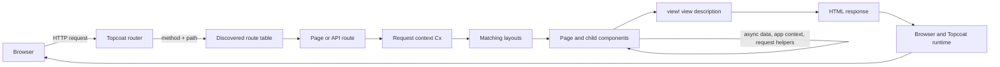

# Request lifecycle

A Topcoat request stays on the server from routing through HTML generation. You can follow it as a
short chain: the router selects a page, Topcoat creates a request context, layouts and components
compose the response, and `view!` describes the HTML sent to the browser.

The routing and view descriptions here follow the pinned v0.8.0 [getting started
guide](https://raw.githubusercontent.com/tokio-rs/topcoat/v0.8.0/crates/topcoat/docs/getting_started.md)
and the release README. The request-context and app-context sections follow the v0.8.0 [app context
guide](https://raw.githubusercontent.com/tokio-rs/topcoat/v0.8.0/crates/topcoat/docs/app_context.md)
and [functions, not middlewares
guide](https://raw.githubusercontent.com/tokio-rs/topcoat/v0.8.0/crates/topcoat/docs/functions_not_middlewares.md).



The diagram describes the server-rendered path. The browser receives HTML first. If the page uses
Topcoat's reactive runtime, the response can also carry the metadata and runtime script needed for
small client-side interactions. That later browser work does not replace the server lifecycle or
turn page data into a separate client API.

## 1. The router selects a target

The request enters the `Router` with an HTTP method and path. You can register pages, layouts, and
routes explicitly, or let `module_router!().discover()` derive the route tree from compiled Rust
modules. A file such as `app/_marketing/berths/id.rs` contributes a logical route beneath the
`_marketing` group, while `path_param!(id)` makes `id` a dynamic segment.

The module tree is part of the route definition, not a directory scan. Rust must compile the module,
and Topcoat's discovery collects the annotated page, layout, or route. Lab 04 moves Slipway from
manual registration to this module-based form.

```rust
{{#include ../../../labs/lab-04-routing/solution/src/app.rs:app-router}}
```

At this point Topcoat knows which handler owns the request. It has not rendered the page yet.

## 2. `Cx` carries the request

Topcoat passes a request-scoped `&Cx` to handlers and components that declare it. `Cx` is where code
reads values selected by the current request: the URI, path parameters, headers, cookies, sessions,
and other request facilities. You pass the same context into request helpers instead of copying
request data through every component parameter.

Keep the lifetime distinction clear:

- **Request context** belongs to one request. It is the right place for the current URI, matched
  parameters, and request-scoped helpers.
- **App context** is registered when you build the router. It holds long-lived values such as a
  database pool, configuration, or HTTP client, and is read through the current `Cx`.

Lab 05 registers an app-scoped value once on the router:

```rust
{{#include ../../../labs/lab-05-cx-memoize/solution/src/app.rs:app-context-router}}
```

A handler can then read that value while still operating in the current request. The value is shared
across requests, but the `Cx` used to reach it is not.

## 3. Layouts and components compose the response

After matching, Topcoat invokes the page through any layouts that apply to its route. A router
layout receives a `Slot<'_>` containing the matched page. An ordinary component receives parameters
and optional child content. Both are ordinary async Rust functions that return a view result.

That distinction matters. A router layout owns a route subtree and wraps every matching page. A
component owns a reusable piece of markup and can be placed wherever its caller needs it. Lab 03
starts with a component layout that accepts `Child<'_>`:

```rust
{{#include ../../../labs/lab-03-components/solution/src/lib.rs:layout}}
```

The page supplies its own nodes as child content. The layout supplies the document shell, navigation,
and footer. This keeps the shell in one place while each page remains focused on its content.

Components can also fetch the data they render. Since they run on the server, a berth card can accept
a slug, load the berth, handle a missing record, and return its markup without a page assembling a
large prop tree first. That is the locality-of-behaviour pattern developed in [Components and
composition](components-and-composition.md).

## 4. `view!` becomes the response

The `view!` macro parses HTML-shaped markup and Rust control flow at compile time. Its result is a
view description, not a browser component tree. Topcoat renders that view when it becomes the page
response or when a parent view interpolates it.

This is why server-side expressions can use ordinary Rust: a component can `await` a database query,
branch on a result, and interpolate escaped values into HTML before the response leaves the server.
See [Views and markup](views-and-markup.md) for the markup rules and rendering details.

Sibling components can perform their async work concurrently. The response is then assembled from
their resulting views under the matching layout. The browser receives one document shell with the
page content in the locations where the layout and components placed it.

## 5. Request context and memoization meet in the component tree

A composed page may ask for the same record more than once. Passing `Cx` to a helper lets every
component reach the request and app context, while `#[memoize]` prevents identical work from running
again during that request.

Lab 05's loader increments a counter before it performs the lookup:

```rust
{{#include ../../../labs/lab-05-cx-memoize/solution/src/shared.rs:memoized-loader}}
```

Three components can call the same loader with the same slug. The first call computes the value; the
later calls reuse the request-local result. App context supplies the shared state, and memoization
belongs to the individual request. A value from one request does not become another user's cached
page data.

This is the point where the lifecycle becomes composable: routing chooses the page, `Cx` supplies
request and app state, components ask for the work they need, and memoization keeps repeated work
bounded without making the page coordinate every lookup itself.

## 6. The browser is the delivery boundary

The browser receives the rendered HTML after the server finishes the lifecycle above. A normal link or
form can therefore work without a client application. When you add `signal` and `$(...)`, Topcoat
also emits the instructions needed for the supported interaction to run in the browser. When an
interaction needs fresh server data, a shard or procedure sends work back through the server rather
than moving the database query into the browser.

Read [How `$(...)` reaches the browser](dual-expressions.md) and [Shards, procedures, live regions,
htmx](reactivity-options.md) for those next steps. The important boundary remains the same: the
server owns page data and the browser enhances the HTML it receives.

**See also:** [Lab 03 — Components and composition](../02-labs/lab-03.md),
[Lab 04 — Routing](../02-labs/lab-04.md), [Lab 05 — Cx, app context, and memoization](../02-labs/lab-05.md),
[Views and markup](views-and-markup.md), and [How `$(...)` reaches the browser](dual-expressions.md).
