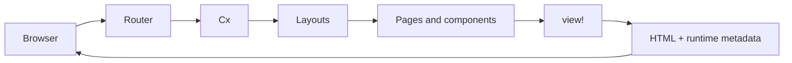

# Topcoat Workshop
## Module 0 — Orientation

**Rust as a green-field language**

From request to rendered HTML, with selective reactivity where it earns its keep.

---

# The workshop thesis

- You already use Rust for services, libraries, or infrastructure.
- A new web application does not automatically justify a second language and toolchain.
- AI shortens the learning loop, but it does not make an immature API stable.
- Topcoat fills the full-stack web gap around tokio and Rust.

> Choose a green-field stack deliberately; do not rewrite a working system just because Rust is interesting.

---

# Where Topcoat sits

| Tool | Centre of gravity | Choose it when |
|---|---|---|
| **Topcoat** | Server-rendered web UI | The server owns page data and you want selective reactivity |
| **Axum** | HTTP and Tower | The product surface is an API or bespoke protocol |
| **Leptos** | Reactive Rust web UI | The browser is a rich application with SSR/hydration |
| **Dioxus** | Cross-platform Rust UI | One UI model spans web, desktop, or mobile |

These are different boundaries, not a maturity ranking.

---

# The Topcoat mental model

The server remains the source of truth. The browser enhances the HTML it receives.

---

# One request, one context

1. The router matches method and path.
2. Topcoat creates the request-scoped `Cx`.
3. Layouts and components read request and app context.
4. Async components fetch the data they render.
5. `view!` describes the HTML response.
6. The browser receives a document, then optional runtime behaviour.

No separate page-data API is required.

---

# Slipway: the thread through every lab

A small marina and boatyard manager grows across the workshop:

- berths and vessels give the UI a domain;
- sessions and auth give request code a purpose;
- searches and work orders make reactivity concrete;
- Toasty replaces in-memory data;
- assets and Tailwind make the result deployable;
- Azure Container Apps makes the final boundary real.

The capstone in `slipway/` is the finished state.

---

# Before you start

- Run `./scripts/setup.sh`, or open the devcontainer/Codespace.
- Use the pinned versions in `COMPATIBILITY.md`.
- Read Topcoat guides at the `v0.7.0` tag, never `main`.
- Expect pre-1.0 breaking changes.
- Start with [Lab 01](../labs/lab-01-hello-topcoat/README.md) after the orientation.

> The slides frame the concepts. The lab READMEs contain the executable steps.

---

# Module 0 checkpoint

You can explain:

- why Topcoat keeps page data on the server;
- how Axum can coexist with Topcoat through the Tower bridge;
- where Topcoat differs from Leptos and Dioxus;
- how a request reaches `view!` and returns HTML;
- which later module teaches each reactivity mechanism.

**Next:** foundations — `view!`, components, and composition.
