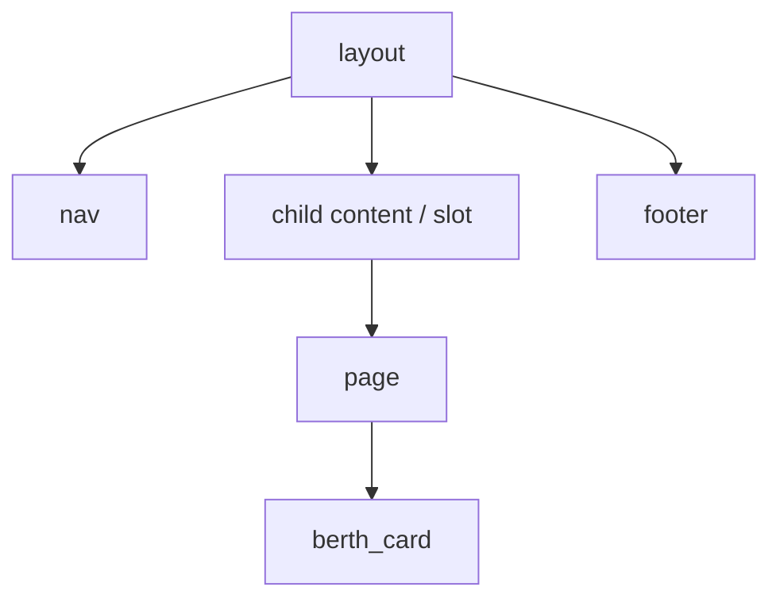

# Module 1 — Foundations
## Markup, components, composition

Turn a Rust function into a page you can read, test, and grow.

---

# `view!` is HTML-shaped Rust

- Tags look like HTML.
- Expressions use parentheses: `(title)`.
- Rust control flow stays near the markup: `for`, `if`, and `match`.
- Values are escaped as they enter the response.
- `topcoat fmt` keeps the macro readable.

The output is a server-side view description, not a browser component tree.

---

# Render data where it belongs

```rust
view! {
  <ul class="berths">
    @for berth in berths {
      <li>{(berth.name)}</li>
    }
  </ul>
}
```

Start with ordinary Rust data. Let the page turn it into HTML.

---

# Control flow stays visible

Use the construct that says what the page means:

- `if` for an optional region;
- `match` for loading, success, and failure states;
- `for` for repeated records;
- conditional attributes for active navigation and state.

The compiler checks the structure before a browser sees it.

---

# Components are async functions

A component can:

- accept typed arguments;
- read `&Cx` when it needs request state;
- fetch data on the server;
- accept child content;
- return a view result.

The component boundary is a Rust function boundary, not a JSON serialization boundary.

---

# Compose a shell once



The layout owns the document shell. The page owns the route's content. Small components own reusable behaviour.

---

# Locality of behaviour starts here

A `berth_card` can load and render its berth where it is used.

That keeps:

- data access beside the markup it supports;
- missing-record handling beside the component;
- reuse possible on home and detail pages;
- the page from becoming a prop-passing coordinator.

Later, Lab 06 applies the same locality idea to authentication.

---

# Lab 01 → Lab 03 path

1. **Lab 01:** create a manual app and render a greeting.
2. **Lab 02:** build Slipway's static shell with `view!`.
3. **Lab 03:** extract `layout`, `nav`, and `berth_card`.

**Checkpoint:** the refactored page renders the same HTML, but each concern has a named owner.

**Next:** routing turns the module tree into URLs.
