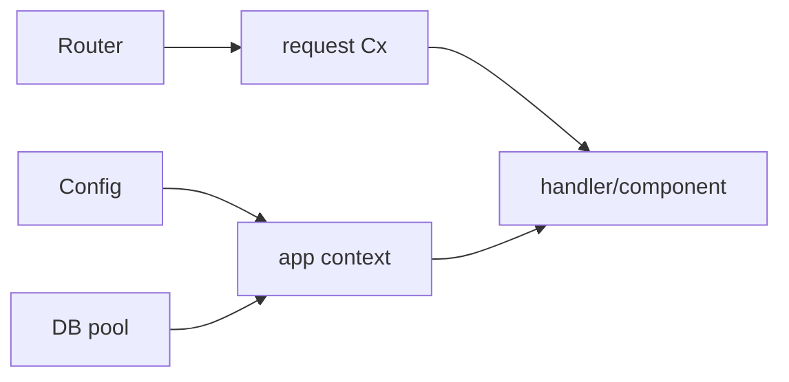

# Module 2 — Routing and the request
## URLs, `Cx`, sessions, and local policy

Make the request visible from route selection through protected markup.

---

# Start explicit, then discover

Manual routing teaches the moving parts:

- method;
- path;
- page, layout, or API response;
- parameters;
- route order.

Module-based discovery then derives routes from Rust modules. The module tree becomes part of the application's URL design.

---

# Module tree → route

| Rust module | Resulting route |
|---|---|
| `app/index.rs` | `/` |
| `app/berths/id.rs` | `/berths/{id}` |
| `app/api/health.rs` | `/api/health` |
| `app/_marketing/...` | grouped layout, hidden URL segment |

The code must compile before discovery can collect it.

---

# `Cx` is the request's handle

Through `&Cx`, a handler can reach:

- URI, method, headers, and path parameters;
- cookies and sessions;
- app-scoped configuration and database pools;
- request-local memoized work;
- response and error helpers.

`Cx` is request-scoped. App context is long-lived and typed.

---

# Request context versus app context

The same `Cx` reaches shared app state without copying a pool or configuration through every function.

---

# Memoize fan-out, not everything

A page may render the same berth in a heading, card, and sidebar.

`#[memoize]` gives identical calls one request-local result:

- app context supplies the shared dependency;
- the first call performs the work;
- later calls reuse the value;
- another request gets its own result.

This is deduplication, not a global cache.

---

# Sessions and auth are request code

Lab 06 adds:

- signed/encrypted cookies;
- a session store;
- login and logout;
- sliding expiry and token rotation;
- a file mail transport for magic links.

Then `require_auth(cx)` reads the session and returns a redirect error when no user is present.

---

# Functions, not middleware

Local guards keep policy beside the behaviour it protects.

- A protected component remains protected when embedded elsewhere.
- A shard or procedure repeats its guard because it is a direct endpoint.
- Middleware still fits transport-wide concerns: tracing, compression, CORS, body limits.

**Trade-off:** local guards are explicit and composable, but they are opt-in. Tests and review must catch omissions.

**Next:** signals and expressions move only the smallest interaction into the browser.
