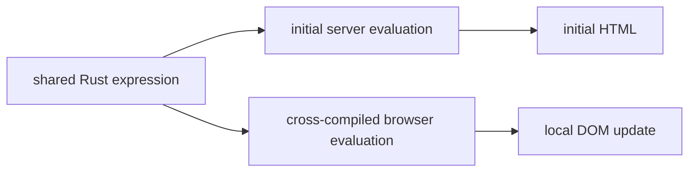

# Module 3 — Reactivity
## Signals, shards, procedures, streaming

Ask one question first: does the browser already have the answer?

---

# Choose by ownership

| Mechanism | Update owner | Best for |
|---|---|---|
| `signal` + `$(...)` | Browser | toggles and filters over rendered data |
| `#[shard]` | Server | new markup from server data |
| `#[procedure]` | Server | an action or value without a markup swap |
| `live!` / `suspense` | Original response | slow regions and progressive delivery |
| htmx / Alpine | Browser markup | pragmatic enhancement and declarative triggers |
| Datastar | Server stream | server-pushed patches over time |

They can coexist on one page.

---

# Signals stay client-only

The server evaluates `$(...)` once for the initial render.

The browser runtime re-runs the supported expression when its signals change.

Use signals for:

- a collapsible panel;
- a local filter over rows already rendered;
- a class or hidden binding;
- input state that does not need fresh server data.

No network request is needed.

---

# The dual-expression boundary

The expression vocabulary is deliberately smaller than all of Rust. The compiler tells you when you leave it.

---

# Shards replace one region

1. The first render runs the shard inline.
2. A signal changes an argument.
3. The runtime sends the current arguments to the shard endpoint.
4. The server validates, authorizes, and queries.
5. Returned HTML replaces only the shard region.

Keep durable state outside the replaced region and pass it in as arguments.

---

# Procedures call the server

Use a procedure when the browser needs a server action or value:

- mark a work order complete;
- save a draft;
- compute a value unavailable in the expression subset.

A procedure is a public HTTP endpoint. Validate arguments and repeat authorization inside it. Page and layout guards do not run first.

---

# Live regions stream the first response

`live!` is not a later interaction request.

- the page starts streaming;
- a slow region emits progress or content;
- `suspense` supplies a fallback;
- `error_boundary` handles a late failure;
- authentication and headers happen before the first emission.

Use this when the page is slow, not when a signal changes later.

---

# htmx, Alpine, and Datastar

- **htmx:** markup decides when to ask; debouncing and indicators are declarative.
- **Alpine AJAX:** choose it when the page already uses Alpine; the client owns the target.
- **Datastar:** the server sends event patches over a stream.

Topcoat's native runtime gives type-checked relationships. Integrations give pragmatic browser ergonomics.

**Checkpoint:** Lab 09 runs native and htmx search side by side.

**Next:** Toasty makes the server's data durable.
