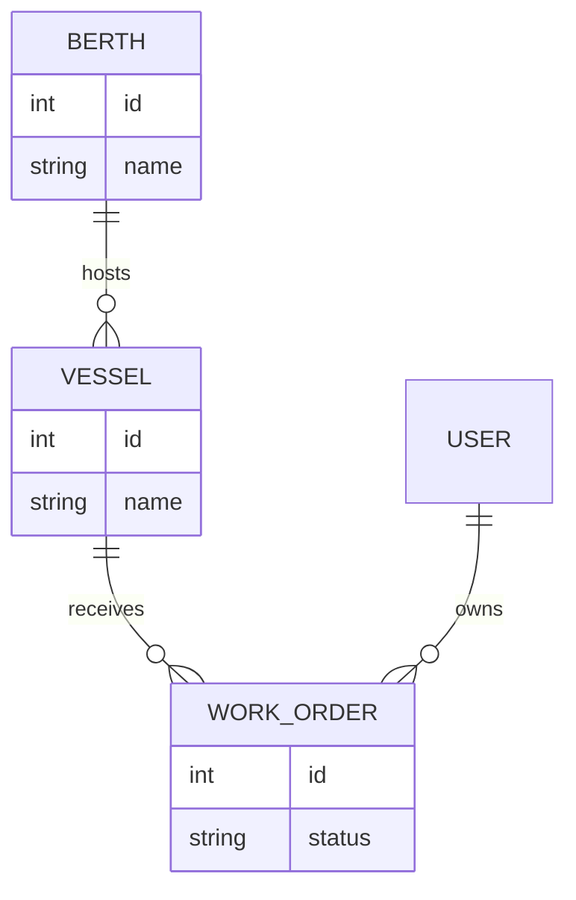
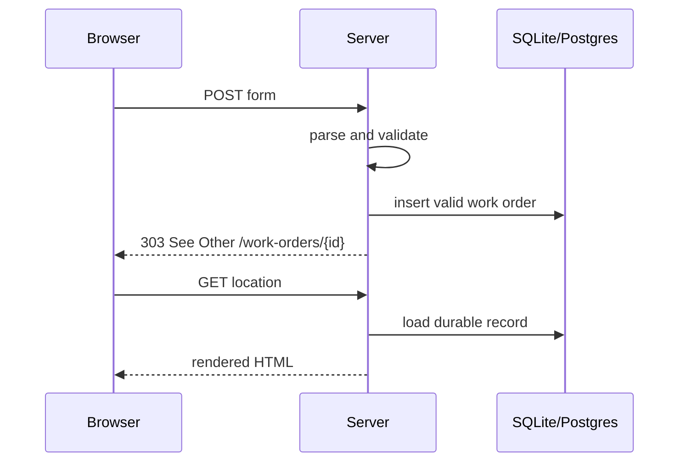

# Module 4 — Data with Toasty
## Durable data, relations, and forms

Replace literals and in-memory maps without moving data access out of the component tree.

---

# Why Toasty belongs here

Topcoat components already run on the server and can be async.

Toasty gives the server-side application:

- typed models;
- relations;
- generated queries;
- migrations and persistence;
- a path from SQLite in the lab to PostgreSQL in deployment.

The component still owns the data it renders.

---

# The data shape behind Slipway

Start with the domain relationships, then express them in Toasty models.

---

# Replace the in-memory boundary

Before:

- `Vec<Berth>` literals;
- maps for sessions;
- restart loses every change.

After:

- queries inside async components;
- database-backed session storage;
- records survive a restart;
- the same request/context model remains.

Do not add a separate JSON data layer just because the source changed.

---

# A request still owns the composition

The page asks for the data it needs.

The component can:

1. read `&Cx`;
2. obtain the app-scoped database pool;
3. run a Toasty query;
4. handle `Option`/`Result` states;
5. return the resulting view.

The request lifecycle is unchanged; only the data source is durable.

---

# Forms are HTTP first

A create-work-order form needs:

- named controls and a method/action;
- server-side parsing;
- validation that does not trust browser constraints;
- a response for success or failure;
- errors rendered beside the form.

The browser is an assistant. The server validates the operation.

---

# Use Post/Redirect/Get

On invalid input, re-render the form with errors. On success, redirect.

---

# Lab 10 checkpoint

You can prove:

- a new work order survives a process restart;
- a bad submission does not insert a record;
- session storage is durable;
- a successful POST redirects before the browser refreshes it;
- the same Slipway component tree works over SQLite.

**Next:** make the durable application look and ship like a product.
