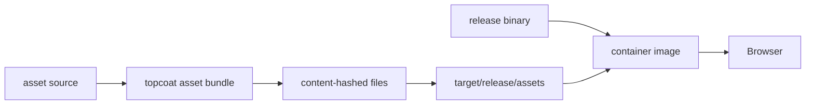

# Module 5 — Assets, styling, and UI
## Ship the page you designed

Own the build output, not just the Rust source.

---

# Assets are part of the application

A browser needs more than HTML:

- content-hashed CSS and JavaScript;
- fonts;
- icons;
- predictable release paths;
- cache-friendly URLs.

Topcoat's asset macros connect source files to the server-rendered page.

---

# The asset pipeline

Build the binary and bundle from the same release build.

---

# No separate Node build required

Lab 11 uses Topcoat features for:

- `asset!` URLs;
- `fontsource_font!` font inclusion;
- `iconify::include!` icons;
- Tailwind through the `tailwind` feature;
- `tailwind::stylesheet!()` in the page.

The point is not that JavaScript tooling is bad. The point is that this application can keep its build boundary in Rust.

---

# Tailwind describes the visual system

Use utility classes to make layout and state visible in the markup:

- spacing and grid for the marina shell;
- responsive navigation;
- focus and disabled states;
- consistent colour and typography tokens.

Then inspect the generated CSS. A small, owned build is easier to deploy than an unexplained asset chain.

---

# Topcoat UI is owned source

`topcoat ui` vendors shadcn-style components into `src/`.

That means:

- the component code is in your repository;
- you can edit it for Slipway's design;
- upgrades are explicit changes, not hidden runtime dependencies;
- one card change can update every card.

Copying source is a trade-off: you gain ownership and take responsibility for maintenance.

---

# Release correctness matters

After a clean build:

1. stage the icon cache with `cargo build -p lab11-solution`;
2. run the release build;
3. run `topcoat asset bundle --release`;
4. package the matching binary and `target/release/assets/`.

Do not mix a debug binary with release assets. Do not run parallel icon-cache builds after `cargo clean`.

---

# Lab 11 checkpoint

Open the release output and verify:

- assets have stable content-hashed URLs;
- fonts and icons render without external runtime fetches;
- Tailwind styles appear in the built page;
- editing the vendored UI component changes Slipway;
- the container can serve the bundle without a development server.

**Next:** containerise and deploy the capstone.
