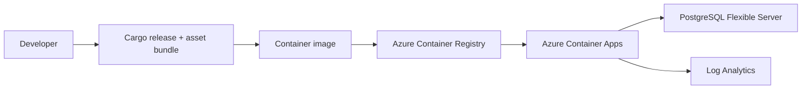
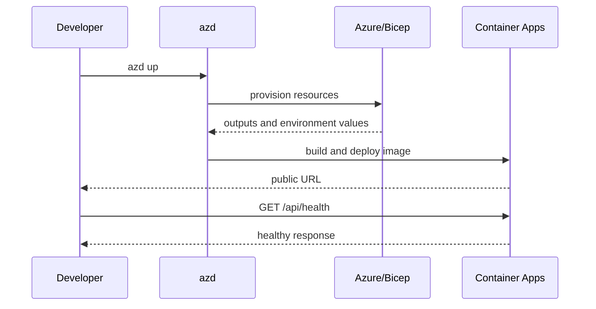

# Module 6 — Production
## Build, containerise, deploy

Turn Slipway's tested release into a running service.

---

# The production boundary

The same server-rendered application runs locally and in the container.

---

# Release build before deployment

Verify locally:

- `cargo build --release` succeeds;
- assets are bundled with the matching release profile;
- configuration comes from environment values;
- `/api/health` returns a useful response;
- logs use `tracing` and do not print secrets;
- the image starts without a development watcher.

A successful local release is a prerequisite, not an optional polish step.

---

# The container is deliberately boring

A multi-stage image:

1. compiles Slipway and its assets;
2. copies only the release binary and bundle into a small runtime image;
3. exposes the configured port;
4. runs as a non-development process;
5. reports health through the application endpoint.

The browser still receives HTML from Topcoat. No client build appears at deployment time.

---

# `azd up` and Bicep

The Azure path uses:

- `azd init` to connect the repo to an environment;
- Bicep-only infrastructure;
- managed identity for registry pull;
- Azure Container Apps;
- Log Analytics;
- a PostgreSQL Flexible Server for durable production data.

Keep secrets out of templates. Bind configuration through the environment contract.

---

# Deployment sequence

Treat `azd env` values as configuration with an explicit owner. Provision outputs do not replace operator-authored inputs.

---

# Lab 12 checkpoint

`azd up` gives you:

- a public Slipway URL;
- a healthy container;
- logs visible through `azd monitor --logs`;
- data stored outside the container;
- a deployment you can tear down with the documented purge sequence.

Test the URL, not only the provisioning transcript.

---

# Lab 13: Topcoat plus Axum

The Tower bridge lets one application use both boundaries:

- Topcoat owns server-rendered pages and application UI;
- Axum owns a JSON API subtree;
- Tower layers add cross-cutting HTTP behaviour;
- app context shares the database pool.

Use the tool that matches the endpoint. You do not need to choose one framework for every path.

---

# Capstone complete

You now have one path from:

**`view!` → components → routes → `Cx` → reactivity → Toasty → assets → container → Azure → Axum**

Return to the decision guide when your next application has a different boundary.

**Next steps:** inspect `slipway/`, repeat a lab from scratch, or upgrade the pinned versions deliberately.
